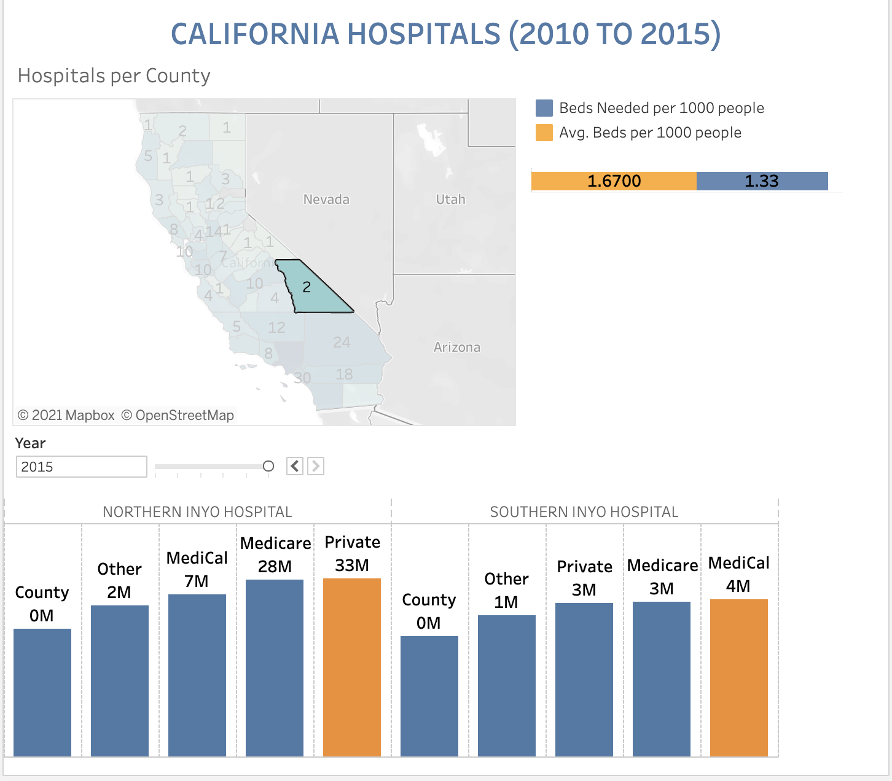

# Hospitals in California 

California is the most populated state in the U.S but unfortunately has a capacity of only 1.9 beds per 1000 which is much lower compared to other states. The aim of this project is look into the hospital data and understand the distribution of hospitals, insurance contracts and beds for every county. 

This research was performed as part of a feasibility analysis for expansion project of ABC Medical Center. Data was obtained from [CHHS Open Data](https://data.chhs.ca.gov/dataset/fourth-quarter-summary-hospital-utilization-net-patient-revenue-by-payer-source)

## Tools

* Excel was used for data cleaning and initial analysis. See [Google Sheets](https://docs.google.com/spreadsheets/d/1F3xSTl-fmgnj26foueOCfgcrOR3ZZDNGwAvcQ2Jw3Go/edit?usp=sharing)
* Tableau Dashboard was created which can filter data by year, county and beds needed to meet the CDC guideline of 3 beds per 1000 population. Population data was also utilized for each year to calculate beds needed.  
* Finding were [presented](https://github.com/PrasunaM/Metis_Business/blob/ac193f1d73e1d3adf70f8acc0692c98d4dfb41ab/Slides_Business%20Module_%20Hospitals%20in%20California.pdf) to the class
  

Here's an image of the dashboard. Live Dashboard is [here](https://public.tableau.com/views/MetisBusinessModule/Dashboard?:language=en-US&:display_count=n&:origin=viz_share_link) 
 
 
 
 

